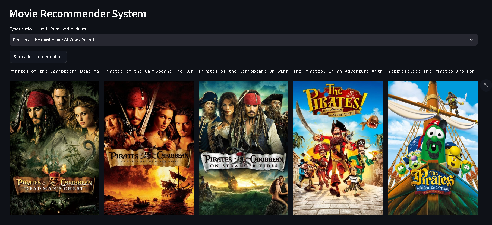

# Movie-Recommendation-System (Content Based)



## Overview
This is a **Content-Based Movie Recommendation System** that suggests movies similar to the one selected by the user. The system utilizes **movie similarity scores** and the **TMDb API** for fetching movie posters.

## Setup and Installation

### 1. Install Requirements
Ensure you have Python installed, then install the required dependencies using:
```bash
pip install -r requirements.txt
```

### 2. Set Up API Key
You need to get a **MOVIE_API_KEY** from [TMDb](https://www.themoviedb.org/) and store it in a `.env` file:
```plaintext
MOVIE_API_KEY=your_actual_bearer_token_here
```

### 3. Run the Notebook
Navigate to the `notebook` folder and execute the Jupyter Notebook to:
- Set the correct path for fetching data.
- Configure the artifacts directory.

### 4. Run the Streamlit App
Execute the following command in the terminal:
```bash
streamlit run app.py
```

## Features
- **Movie Selection:** Choose a movie from the dropdown menu.
- **Content-Based Recommendation:** Recommends top 5 similar movies.
- **Movie Posters:** Fetches and displays posters using TMDb API.
- **Streamlit UI:** Interactive and user-friendly interface.

## Code Explanation
### Key Components:
1. **Loading Environment Variables**
   ```python
   from dotenv import load_dotenv
   load_dotenv()
   MOVIE_API_KEY = os.getenv("MOVIE_API_KEY")
   ```
2. **Fetching Movie Posters** from TMDb using v4 Authentication.
   ```python
   def fetch_poster(movie_id):
       url = f"https://api.themoviedb.org/3/movie/{movie_id}?language=en-US"
       headers = {"Authorization": f"Bearer {MOVIE_API_KEY}", "Content-Type": "application/json"}
       response = requests.get(url, headers=headers)
       data = response.json()
       return f"https://image.tmdb.org/t/p/w500{data['poster_path']}" if 'poster_path' in data else "No Poster Available"
   ```
3. **Movie Recommendation System**
   ```python
   def recommend(movie):
       index = movies[movies['title'] == movie].index[0]
       distances = sorted(list(enumerate(similarity[index])), reverse=True, key=lambda x: x[1])
       return [movies.iloc[i[0]].title for i in distances[1:6]]
   ```
4. **Streamlit UI**
   ```python
   st.selectbox("Select a Movie", movie_list)
   if st.button('Show Recommendation'):
       recommended_movies, posters = recommend(selected_movie)
       st.image(posters)
   ```

## Folder Structure
```
Movie-Recommendation-System/
│── artifacts/               # Stores movie_list.pkl and similarity_score.pkl
│── notebook/                # Jupyter Notebook for data processing
│── app.py                   # Streamlit app
│── requirements.txt         # Required dependencies
│── .env                     # API Key storage
│── README.md                # Project documentation
```


